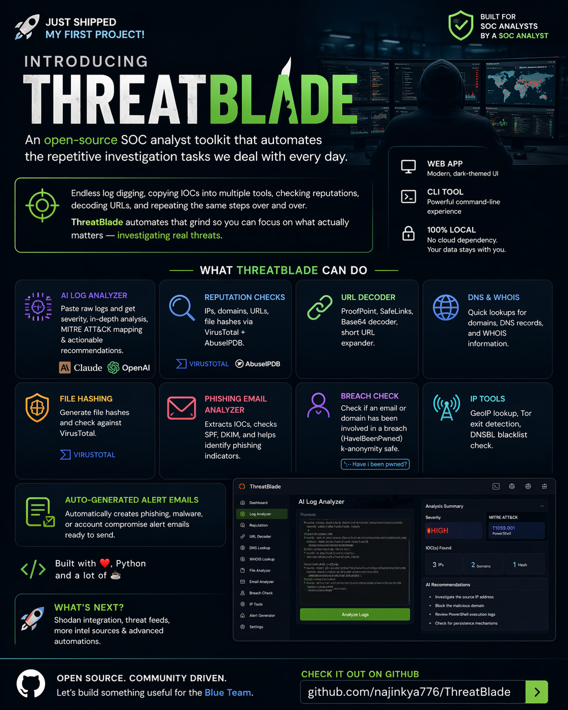

<div align="center">

```
  ████████╗██╗  ██╗██████╗ ███████╗ █████╗ ████████╗    ██████╗ ██╗      █████╗ ██████╗ ███████╗
  ╚══██╔══╝██║  ██║██╔══██╗██╔════╝██╔══██╗╚══██╔══╝    ██╔══██╗██║     ██╔══██╗██╔══██╗██╔════╝
     ██║   ███████║██████╔╝█████╗  ███████║   ██║       ██████╔╝██║     ███████║██║  ██║█████╗
     ██║   ██╔══██║██╔══██╗██╔══╝  ██╔══██║   ██║       ██╔══██╗██║     ██╔══██║██║  ██║██╔══╝
     ██║   ██║  ██║██║  ██║███████╗██║  ██║   ██║       ██████╔╝███████╗██║  ██║██████╔╝███████╗
     ╚═╝   ╚═╝  ╚═╝╚═╝  ╚═╝╚══════╝╚═╝  ╚═╝   ╚═╝       ╚═════╝ ╚══════╝╚═╝  ╚═╝╚═════╝ ╚══════╝
```

**SOC Analyst Automation Toolkit**

[](https://python.org)
[](https://flask.palletsprojects.com)
[](LICENSE)
[](https://github.com/najinkya776/ThreatBlade/issues)
[](https://github.com/najinkya776/ThreatBlade/stargazers)
[](CONTRIBUTING.md)

*Automate the tedious. Focus on the threats.*

[Features](#features) · [Quick Start](#quick-start) · [API Keys](#api-keys) · [Usage](#usage) · [Contributing](CONTRIBUTING.md)

</div>

---

<div align="center">
  
</div>

---

## What is ThreatBlade?

ThreatBlade is an open-source SOC (Security Operations Center) analyst toolkit that automates the repetitive investigation tasks analysts face every day — reputation lookups, URL decoding, email triage, breach checks, and more.

Available as both a **web app** and a **CLI tool**. No cloud dependency, runs entirely on your machine.

---

## Features

| Module | Description | APIs Used |
|---|---|---|
| **🤖 AI Log Analyzer** | Paste raw logs — AI returns severity, full analysis, MITRE ATT&CK mapping, recommendations + auto IOC enrichment | Claude / OpenAI |
| **Reputation Check** | Scan IPs, domains, URLs, and file hashes for malicious activity | VirusTotal, AbuseIPDB |
| **URL Tools** | Defang/refang, decode ProofPoint & SafeLinks, expand short URLs, extract URLs from text | — |
| **DNS & WHOIS** | Full DNS record lookup (A/MX/TXT/NS/CNAME/SOA), WHOIS, reverse DNS | — |
| **Hash Tools** | MD5/SHA1/SHA256 file & string hashing with VirusTotal hash reputation | VirusTotal |
| **Email Analyzer** | Parse `.eml` files — extract IOCs, check SPF/DKIM, detect phishing indicators | — |
| **Breach Check** | Email/domain breach lookup + safe password exposure check (k-anonymity) | HaveIBeenPwned |
| **IP Tools** | GeoIP, Tor exit node detection, DNSBL blacklist check across 10 lists | ip-api.com |
| **Alert Templates** | Generate phishing / malware / account-compromise response emails instantly | — |

---

## Quick Start

### Prerequisites

- Python 3.8+
- pip

### Installation

```bash
git clone https://github.com/najinkya776/ThreatBlade.git
cd ThreatBlade
pip install -r requirements.txt
```

### Run the Web App

```bash
python app.py
```

Open [http://localhost:5000](http://localhost:5000) in your browser.

### Run the CLI

```bash
python threatblade.py
```

---

## API Keys

ThreatBlade works out of the box for DNS, URL tools, and IP geolocation with **no API keys required**.

For full functionality, add optional keys via the **Settings** page in the web app (or option 9 in the CLI):

| Service | Required For | Get Key |
|---|---|---|
| [Anthropic Claude](https://console.anthropic.com) | AI Log Analyzer (Claude models) | Free credits on signup |
| [OpenAI](https://platform.openai.com/api-keys) | AI Log Analyzer (GPT models) | Pay-as-you-go |
| [VirusTotal](https://www.virustotal.com/gui/my-apikey) | Reputation checks, hash lookup | Free tier available |
| [AbuseIPDB](https://www.abuseipdb.com/account/api) | IP abuse score | Free tier available |
| [HaveIBeenPwned](https://haveibeenpwned.com/API/Key) | Breach / credential checks | ~$3.50/month |
| [URLScan.io](https://urlscan.io/user/profile/) | URL scanning | Free tier available |

Keys are stored locally in `config/keys.json` — this file is **gitignored** and never committed.

---

## Usage

### Web App

Navigate the sidebar to switch between tools. All results appear inline without page reloads.

**Reputation Check**
- Select type (IP / Domain / URL / Hash), paste the IOC, hit Scan
- Pulls results from VirusTotal and AbuseIPDB simultaneously

**Email Analyzer**
- Upload a `.eml` file exported from your email client
- Extracts headers, URLs, IPs, attachment info, checks SPF/DKIM, flags phishing keywords

**Breach Check — Password**
- Uses k-anonymity: only the first 5 characters of the SHA1 hash are sent to HIBP
- Your actual password is never transmitted

### CLI

```
threatBlade > 1    # Reputation check
threatBlade > 2    # URL tools
threatBlade > 3    # DNS & WHOIS
threatBlade > 4    # Hash tools
threatBlade > 5    # Email analyzer
threatBlade > 6    # Breach check
threatBlade > 7    # IP tools
threatBlade > 8    # Alert templates
threatBlade > 9    # Settings
```

---

## Project Structure

```
ThreatBlade/
├── app.py                  # Flask web application + all API routes
├── threatblade.py          # CLI entry point
├── requirements.txt
├── config/
│   ├── settings.py         # API key management
│   └── keys.json.example   # Template — copy to keys.json and fill in
├── modules/
│   ├── log_analyzer.py     # AI log analysis (Claude + OpenAI) + IOC enrichment
│   ├── reputation.py       # VirusTotal + AbuseIPDB
│   ├── url_tools.py        # URL decode / sanitize
│   ├── dns_tools.py        # DNS + WHOIS
│   ├── hash_tools.py       # File/string hashing
│   ├── email_analyzer.py   # .eml parsing + IOC extraction
│   ├── breach_check.py     # HaveIBeenPwned
│   ├── ip_tools.py         # GeoIP / Tor / DNSBL
│   └── templates.py        # Alert email generator
├── static/
│   ├── css/style.css
│   └── js/app.js
└── templates/
    └── index.html
```

---

## Contributing

Contributions are welcome! See [CONTRIBUTING.md](CONTRIBUTING.md) for guidelines.

Ideas for new modules: Shodan lookup, URLScan.io submission, Sigma rule generator, threat feed integration.

---

## Security

API keys are stored locally only. See [SECURITY.md](SECURITY.md) for the vulnerability disclosure policy.

---

## License

MIT — see [LICENSE](LICENSE) for details.

---

<div align="center">
Built for the blue team by <a href="https://github.com/najinkya776">Ajinkya Kadam</a>. Made with Python.
</div>
